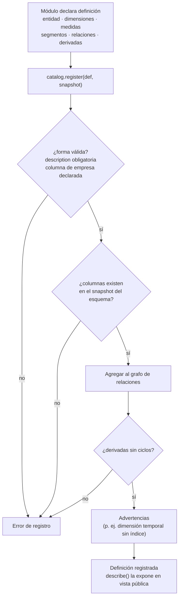
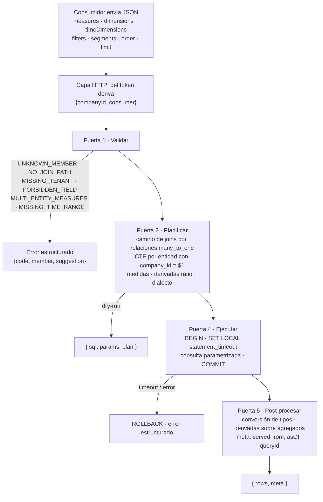
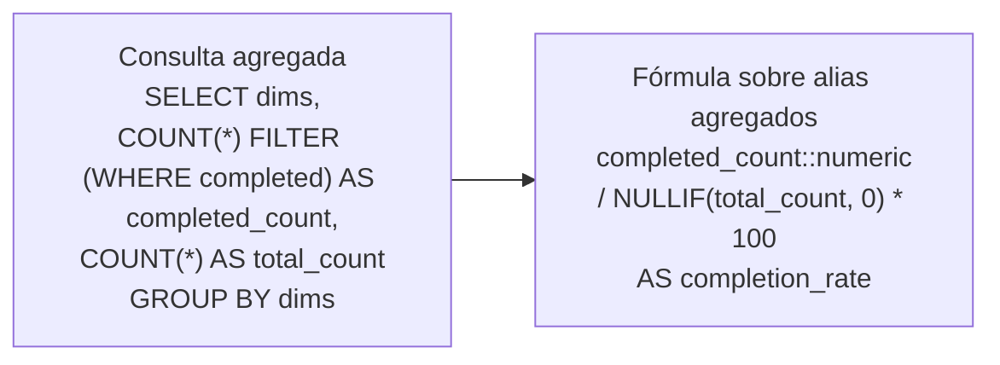

# PRD — Capa Semántica de Analítica

Vocabulario: ver `CONTEXT.md`. Decisiones difíciles de revertir: `docs/adr/`.
Riesgos: `docs/riesgos.md`. Investigación previa: `docs/investigacion.md`.

## Enunciado del Problema

Una plataforma SaaS de gestión de personas atiende a cientos de empresas.
Cada módulo (evaluaciones de desempeño, asistencia, cursos) tiene sus propias
tablas y su propia lógica de consulta. Cuando un equipo necesita datos de otro
módulo debe conocer su estructura interna y escribir SQL. Eso produce tres
dolores:

- **Acoplamiento**: renombrar una columna o cambiar una relación rompe
  consultas de otros equipos.
- **Duplicación de lógica**: "evaluación completada" o "empleado activo" se
  implementan de formas distintas y dan números distintos para la misma pregunta.
- **Falta de interfaz común**: no hay forma estándar de saber qué datos existen
  ni de pedir información analítica sin conocer la base. Un agente de IA que
  genera consultas desde lenguaje natural no puede operar con seguridad.

Además, todos los datos son multi-empresa: cualquier consulta debe ver solo
los datos de la empresa del usuario, sin que el consumidor tenga que
recordarlo.

## Solución

Una capa semántica con tres piezas separadas:

1. **Definiciones**: cada módulo declara, con nombres de negocio, sus
   entidades, dimensiones, medidas, segmentos, relaciones y medidas derivadas.
   Sin SQL.
2. **Catálogo**: registra y valida las definiciones contra el esquema físico
   real, arma el grafo de relaciones y expone `describe()` en una vista
   pública (sin nombres de tablas) para dashboards y agentes.
3. **Query Engine**: recibe una consulta declarativa en JSON con el vocabulario
   de Cube y un contexto de sesión que construye el servidor, y genera SQL
   parametrizado: resuelve los JOIN desde las relaciones, mete el filtro de
   empresa dentro de la CTE de cada entidad, calcula las derivadas sobre
   agregados y ejecuta con límites por clase de consumidor.

El consumidor nunca escribe SQL, nunca nombra una tabla y nunca envía el
identificador de su empresa. Agregar un módulo es un archivo de definición.

## Flujo Principal

### Registro de un módulo (una vez, al arrancar)

### Camino de una consulta

### Medida derivada en dos etapas

## Historias de Usuario

**Equipo dueño de un módulo**

1. Como equipo de Evaluaciones de Desempeño, quiero declarar mis entidades, dimensiones y medidas con nombres de negocio, para poder exponer mis datos sin escribir ni mantener SQL de consulta.
2. Como equipo dueño de un módulo, quiero declarar "evaluación completada" una sola vez como segmento, para poder garantizar que todos los consumidores usan la misma regla.
3. Como equipo dueño de un módulo, quiero declarar relaciones tipadas hacia otras entidades, para poder que el engine resuelva los JOIN sin que yo escriba condiciones de unión.
4. Como equipo dueño de un módulo, quiero declarar una medida derivada como razón entre dos medidas, para poder exponer tasas sin preocuparme de la división entera ni del cálculo por fila.
5. Como equipo dueño de un módulo, quiero que el registro falle si una columna declarada no existe en la base, para poder detectar un cambio de esquema antes de que rompa un dashboard.
6. Como equipo dueño de un módulo, quiero recibir advertencias al registrar (por ejemplo, dimensión temporal sin índice), para poder corregir problemas de rendimiento antes de producción.
7. Como equipo dueño de un módulo, quiero que la descripción de cada entidad, dimensión y medida sea obligatoria, para poder que consumidores y agentes entiendan el significado sin preguntarme.
8. Como equipo dueño de un módulo, quiero registrar consultas tipo con nombre y parámetros, para poder ofrecer plantillas probadas a los dashboards.
9. Como equipo dueño de un módulo nuevo (asistencia), quiero agregar mi definición sin tocar el engine ni a otros consumidores, para poder integrarme en un solo paso.

**Desarrollador de dashboards**

10. Como desarrollador de dashboards, quiero pedir "score promedio y evaluaciones completadas por departamento y trimestre de 2025" en JSON, para poder graficarlo sin conocer las tablas.
11. Como desarrollador de dashboards, quiero usar el mismo vocabulario de consulta que Cube, para poder reutilizar lo que ya sé y migrar consultas existentes sin reescribirlas.
12. Como desarrollador de dashboards, quiero que la empresa se aplique sola, para poder no cargar con el identificador en cada llamada ni poder equivocarme.
13. Como desarrollador de dashboards, quiero consultar el catálogo público, para poder llenar los selectores de métricas, dimensiones y granularidades de mi constructor de gráficos.
14. Como desarrollador de dashboards, quiero obtener los valores de una dimensión (lista de departamentos) con una consulta normal, para poder poblar un desplegable.
15. Como desarrollador de dashboards, quiero llamar una consulta tipo por nombre con parámetros, para poder construir pantallas fijas sin armar JSON.
16. Como desarrollador de dashboards, quiero recibir un error claro con sugerencia cuando escribo mal un nombre, para poder corregirlo sin revisar la definición.
17. Como desarrollador de dashboards, quiero que la respuesta incluya `servedFrom`, `asOf` y `queryId`, para poder mostrar la antigüedad del dato y reportar un problema con precisión.
18. Como desarrollador de dashboards, quiero recibir una advertencia si aplico un filtro global que deja una tasa siempre en 100 %, para poder no mostrar un número engañoso.

**API interna**

19. Como API interna, quiero enviar una consulta declarativa y recibir filas con nombres semánticos, para poder componer respuestas sin acoplarme a las tablas de otro módulo.
20. Como API interna, quiero un presupuesto de tiempo y de filas propio de mi clase de consumidor, para poder que una consulta cara no degrade al resto.
21. Como API interna, quiero recibir los números grandes ya convertidos a tipos numéricos, para poder operar sobre ellos sin manejar cadenas.

**Agente de IA**

22. Como agente de IA, quiero leer el catálogo público con descripciones, para poder traducir una pregunta en lenguaje natural a una consulta válida.
23. Como agente de IA, quiero que solo exista una forma declarativa de consultar, sin campo para SQL, para poder no generar nunca una consulta que dañe la base.
24. Como agente de IA, quiero un error estructurado con sugerencia cuando me equivoco, para poder reintentar sin intervención humana.
25. Como agente de IA, quiero un dry-run que me devuelva el plan lógico sin ejecutar, para poder verificar la consulta antes de gastar recursos.
26. Como agente de IA, quiero que se me exija un rango temporal y un límite de filas, para poder no producir por accidente una consulta que no termina.
27. Como agente de IA, quiero que pedir medidas de dos entidades distintas se rechace con un mensaje claro, para poder no devolver un número multiplicado por un JOIN.

**Equipo de plataforma**

28. Como equipo de plataforma, quiero que el filtro de empresa viva dentro de la CTE de cada entidad, para poder demostrar con un test que ninguna tabla queda sin filtrar.
29. Como equipo de plataforma, quiero que ningún consumidor pueda enviar su propio identificador de empresa o clase de consumidor, para poder centralizar el aislamiento por construcción y no por convención.
30. Como equipo de plataforma, quiero que el timeout se fije dentro de la transacción y se limpie al devolver la conexión, para poder usar un pool sin que el estado de una petición contamine la siguiente.
31. Como equipo de plataforma, quiero telemetría por puerta, consumidor y código de error, para poder ver dónde se va el tiempo y cuántas consultas se rechazan.
32. Como equipo de plataforma, quiero levantar base y servicio con un solo comando de Docker, para poder reproducir el entorno y correr los tests en cualquier máquina.
33. Como equipo de plataforma, quiero que el catálogo se pueda probar sin base inyectando una foto del esquema, para poder correr la mayoría de los tests en segundos.

## Decisiones de Implementación

**Lenguaje y entorno**

- JavaScript puro sobre Node 24, sin TypeScript. Acceso a la base con
  node-postgres y placeholders `$1..$n`.
- `docker-compose.yml` con dos servicios: `db` (`postgres:16`, esquema del
  caso y seed de dos empresas) y `api` (servicio Node). El front no forma
  parte del entregable; la demo por consola hace su papel.

**Definiciones** (ADR 0001, 0005)

- Cada módulo exporta un objeto de definición por entidad: tabla, clave,
  columna de empresa, dimensión temporal, descripción, dimensiones (columna,
  tipo, descripción), medidas (`count`, `sum`, `avg`, con filtros
  declarativos opcionales), segmentos declarativos, relaciones tipadas
  (`many_to_one` con columnas de unión) y derivadas de tipo `ratio`.
- Ningún campo acepta SQL. Los filtros se expresan como
  `{ member, operator, value }`.

**Catálogo** (ADR 0001, 0008)

- `register(def, snapshot)`: valida forma, descripción obligatoria y columna de
  empresa; comprueba tablas y columnas contra el snapshot del esquema físico;
  agrega la entidad al grafo; ordena topológicamente las derivadas y rechaza
  ciclos; devuelve advertencias (por ejemplo, dimensión temporal sin índice).
- `introspect(pool)`: produce el snapshot desde `information_schema` y
  `pg_indexes`. Es la única parte del catálogo que toca la base.
- `describe(ctx)`: vista pública filtrada por empresa y rol: entidades,
  dimensiones con tipo y operadores, medidas, segmentos, derivadas,
  granularidades, consultas tipo. Sin nombres físicos.
- `registerQuery(nombre, consulta)`: consultas tipo con parámetros.
- Versión del catálogo: hash de definiciones más snapshot.

**Consulta declarativa** (ADR 0007)

- `{ measures, dimensions, timeDimensions: [{ dimension, granularity, dateRange }],
  filters: [{ member, operator, values }], segments, order, limit }`.
- Miembros con la forma `entidad.miembro`. Operadores: `equals`, `notEquals`,
  `in`, `notIn`, `gt`, `gte`, `lt`, `lte`, `set`, `notSet`.
- Semántica de filtros: los globales aplican a todas las medidas; el filtro
  propio de una medida se suma con AND. El engine advierte cuando un filtro
  global anula el denominador de una razón.

**Contexto de sesión** (ADR 0002)

- `ctx = { companyId, consumer }` lo construye la capa HTTP desde el token.
  `consumer` ∈ `dashboard | api | agent`.
- Presupuestos por consumidor como tabla de configuración: timeout, límite
  máximo de filas, rango temporal obligatorio. Valores iniciales: dashboard 5 s
  y 5000 filas; api 15 s y 10000 filas; agent 10 s, 1000 filas y rango
  obligatorio.

**Engine** (ADR 0003, 0004, 0006)

- Pipeline de puertas; cada puerta es una función que recibe y devuelve el
  contexto o corta con una respuesta. Puertas en v1: validar, planificar,
  ejecutar, post-procesar. Estimación de costo y caché quedan como costuras
  documentadas, no implementadas.
- Validar: miembros existentes con sugerencia por distancia de edición,
  camino de joins, campos prohibidos en el JSON, medidas de una sola entidad,
  rango temporal cuando la entidad lo exige, operadores válidos.
- Planificar: BFS sobre relaciones `many_to_one` desde la entidad de hechos;
  una CTE por entidad con `company_id = $1`; `DATE_TRUNC` por granularidad;
  medidas con filtro como `COUNT(*) FILTER (WHERE …)` según el dialecto;
  derivadas `ratio` con `::numeric` y `NULLIF`; `GROUP BY`, `ORDER BY`,
  `LIMIT`; parámetros `$n`.
- Dialecto: objeto `postgres` con capacidades `agregadoFiltrado` y
  `dateTrunc`, consultado por el planificador. La tabla completa de
  capacidades por motor es evolución.
- Ejecutar: cliente tomado del pool; `BEGIN`; `SET LOCAL statement_timeout`
  del consumidor; consulta parametrizada; `COMMIT`; `ROLLBACK` ante error
  antes de liberar el cliente.
- Post-procesar: conversión de `int8` y `numeric` (llegan como texto) a
  número; `meta.servedFrom = 'live'`, `asOf`, `queryId` (hash canónico de la
  forma de la consulta más empresa); SQL incluido solo con bandera de depuración.
- Dry-run: `plan(consulta, ctx)` devuelve `{ sql, params, plan }` sin tocar la base.
- Telemetría en memoria: contadores por resultado y código de error,
  duración por puerta y de base, expuestos por una función del engine y
  mostrados al final de la demo.

**Capa HTTP**

- `POST /analytics/query` y `GET /analytics/catalog`. Traduce el token a
  contexto y delega en el engine. Delgada: sin lógica de negocio.

**Demo**

- Comando que registra las definiciones, imprime el catálogo público y
  ejecuta las tres preguntas del caso mostrando JSON, SQL generado y filas.

## Decisiones de Testing

- **Qué es un buen test aquí**: entra por el seam público, con datos reales de
  dos empresas, y comprueba resultados observables: filas devueltas, SQL
  generado, error estructurado. No inspecciona funciones internas del engine.
- **Seams**:
  1. `engine.run(consulta, ctx)` → `{ rows, meta }` o error estructurado.
     Seam principal; corre contra Postgres en Docker.
  2. `engine.plan(consulta, ctx)` → `{ sql, params, plan }`. Para snapshots de
     SQL y validación sin base.
  3. `catalog.register(def, snapshot)` y `catalog.describe(ctx)`. Sin base,
     con snapshot inyectado.
  La capa HTTP solo tiene una prueba de humo.
- **Runner y comando**: `node:test` nativo. `docker compose up -d db` y luego
  `npm test`. Los tests que necesitan base leen la conexión de una variable de
  entorno y se saltan con aviso si no está. No hay infraestructura de tests
  todavía: montarla es la primera tarea de la fase 1 del plan.
- **Seed**: dos empresas con departamentos, empleados, evaluaciones (con
  estados `pending`, `completed`, `calibrated` en 2024 y 2025) y asistencia.
  Al menos un departamento con 3 evaluaciones completadas de 4 para probar
  `completion_rate = 75`.
- **Tests comprometidos**:
  - Caso obligatorio: score promedio y evaluaciones completadas por
    departamento y trimestre de 2025, con números esperados calculados a mano
    desde el seed.
  - `completion_rate` sobre agregados: 3 de 4 da 75, no 0.
  - Aislamiento: la empresa B nunca aparece en resultados de la A; invariante
    sobre todas las consultas tipo: cada CTE sobre una tabla con columna de
    empresa contiene `company_id = $1`.
  - Tenant faltante → `MISSING_TENANT`; `companyId` o `consumer` en el JSON →
    `FORBIDDEN_FIELD`.
  - Medidas de dos entidades → `MULTI_ENTITY_MEASURES`.
  - Nombre mal escrito → `UNKNOWN_MEMBER` con sugerencia correcta.
  - Sin relación declarada → `NO_JOIN_PATH`.
  - Consumidor `agent` sin rango temporal → `MISSING_TIME_RANGE`.
  - Filtro global que anula el denominador → advertencia en `meta`.
  - `COUNT` grande y `AVG` llegan como número, no como texto.
  - Snapshot del SQL generado del caso obligatorio.
  - Consultas tipo como regresión: cada una genera el SQL esperado y devuelve filas.
  - Catálogo sin base: registro válido, columna inexistente rechazada,
    derivada circular rechazada, `describe()` sin nombres físicos ni datos de
    otra empresa.
  - Pool de tamaño 1 con dos empresas alternadas: sin cruce.
  - Timeout del consumidor: una consulta con `pg_sleep` en el seed de prueba
    corta y la conexión vuelve limpia al pool.
- **Antecedentes**: no hay tests previos en el repo.

## Fuera de Alcance

- Autenticación, OAuth y MFA: la aplicación entrega un usuario ya autenticado;
  la capa solo consume su `company_id` y clase de consumidor.
- Front end: se entrega el contrato HTTP y la demo por consola.
- Estimación de costo con `EXPLAIN` y clasificación ligera/media/pesada.
- Caché de resultados (memoria, Redis, Parquet), single-flight,
  pre-agregaciones y vistas materializadas.
- Trabajos asíncronos y cola.
- Fuentes externas, presupuestos por fuente y circuit breaker.
- Tenancy por esquema o por base de datos; `TenantResolver` alternativo.
- Row Level Security en Postgres.
- Plantillas aprendidas desde lenguaje natural.
- Medidas de más de una entidad en la misma consulta (agregación por entidad
  antes del join).
- Dialectos distintos de Postgres.
- Exportador de telemetría (Prometheus, OpenTelemetry).

Cada punto tiene su costura nombrada en el diseño y se documenta como
evolución con su costo y beneficio.

## Notas Adicionales

- Entregables paralelos, fuera de este PRD: documento técnico de dos páginas
  según la plantilla del caso y sesión de presentación. Este repo debe
  bastar para reproducir la demo y los tests sin explicación adicional.
- Convención de git: `main` recibe solo merges de ramas; commits
  `[<parte>] descripción` en español.
- La consulta y las definiciones usan el vocabulario de Cube a propósito, para
  que el equipo lo reconozca y para que la migración de un consumidor
  existente sea un cambio de endpoint.
