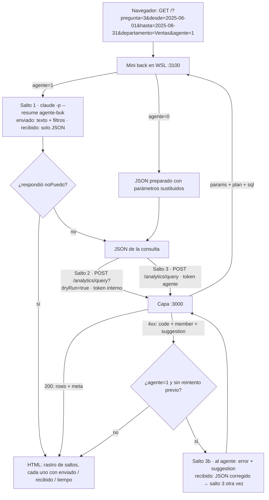
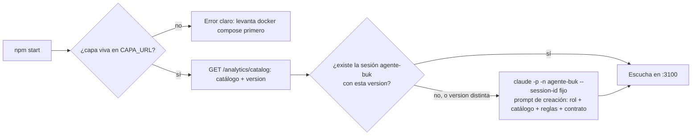

# PRD — Demo agente: mini back y front en WSL

Fecha: 2026-09-09. Origen: discusión 28 (`prueba-tecnica/discusiones/28-demo-agente.md`).
Vive en `demo-agente/` dentro del repo, con `package.json`, tests y README propios.
No modifica la capa (`src/`).

## Enunciado del Problema

La capa semántica demuestra su tesis —el agente escribe JSON, nunca SQL; la
capa lo valida y le devuelve errores con sugerencia— solo por `curl`, tests y
la demo de consola. Nadie ve, paso a paso, qué recibe el agente, qué escribe,
qué le responde la capa y cómo se corrige. Para la defensa hace falta verlo en
vivo y de forma gráfica, sin depender de que Claude Code funcione ese día ni de
escribir preguntas al vuelo que puedan salir mal.

## Solución

Un servidor pequeño en WSL (`demo-agente/`) que sirve una página por GET. La
persona elige una pregunta preparada (editable), ajusta filtros manuales
(desde, hasta, departamento), marca o no "usar agente" y envía. La página
muestra el **rastro de llamadas** en orden, cada salto con lo enviado y lo
recibido en bloques de texto plano y su tiempo:

1. Al agente (sesión nombrada de Claude Code por `claude -p --resume`), solo si
   "usar agente" está activo: recibe texto y filtros, devuelve el JSON de la
   consulta.
2. A la capa en dry-run, con el token interno: devuelve parámetros, plan y SQL.
3. A la capa, consulta real, con el token de clase `agente`: devuelve filas y
   `meta` (`servedFrom`, `asOf`, `queryId`, `warnings`).
4. Si la capa rechaza el JSON y el agente está activo: se le reenvía el error
   con su `suggestion`, devuelve un JSON corregido y se repite el paso 3. Un
   solo reintento.

Sin agente, el JSON preparado con los parámetros sustituidos va directo al
paso 2: la demo sigue viva aunque Claude Code falle. Cada combinación del
formulario es una URL; recargarla repite la consulta y se ve pasar de `live` a
`cache-l1`. Una página aparte, `/agente/sesion`, muestra el prompt completo con
que se creó la sesión del agente: rol, catálogo, reglas y contrato de salida.

## Flujo Principal

Arranque del servidor:

## Historias de Usuario

1. Como expositor en la defensa, quiero elegir una pregunta preparada y ver el rastro completo de llamadas, para poder explicar cómo el agente y la capa se hablan sin improvisar.
2. Como expositor, quiero editar el texto de la pregunta preparada antes de enviarla, para poder mostrar una variante sobre la marcha sin salir de lo preparado.
3. Como expositor, quiero ajustar desde, hasta y departamento en el formulario, para poder mostrar `timeDimensions` y `filters` cambiando el JSON y el SQL.
4. Como expositor, quiero marcar o desmarcar "usar agente", para poder comparar el JSON que escribió el agente con el preparado, y para tener camino de escape si Claude Code falla.
5. Como expositor, quiero ver por cada salto lo enviado y lo recibido en texto plano, para poder señalar con el dedo qué recibió cada pieza.
6. Como expositor, quiero ver el tiempo de cada salto, para poder mostrar que el LLM tarda segundos y la capa milisegundos.
7. Como expositor, quiero ver el dry-run con parámetros, plan y SQL, para poder mostrar el SQL que emite la capa y que el agente nunca vio.
8. Como expositor, quiero ver en la consulta real `servedFrom`, `asOf`, `queryId` y `warnings`, para poder explicar la caché y la trazabilidad.
9. Como expositor, quiero recargar la misma URL y ver `cache-l1`, para poder demostrar la caché sin herramientas extra.
10. Como expositor, quiero una pregunta trampa (sueldo promedio) que no existe en el catálogo, para poder mostrar `UNKNOWN_MEMBER` con sugerencia y al agente respondiendo que no puede en vez de inventar.
11. Como expositor, quiero ver el reintento cuando la capa rechaza el JSON del agente, para poder mostrar el bucle de corrección guiado por `suggestion`.
12. Como expositor, quiero que haya un solo reintento, para poder garantizar que la demo termina aunque el agente insista en un error.
13. Como expositor, quiero abrir `/agente/sesion` y ver el prompt de creación completo, para poder decir "esto es todo lo que sabe el agente".
14. Como expositor, quiero que el agente reciba el catálogo público tal cual lo publica la capa, para poder afirmar que no conoce tablas ni columnas.
15. Como expositor, quiero que el agente solo pueda responder JSON o `noPuedo`, para poder mostrar que no escribe SQL ni prosa.
16. Como expositor, quiero que el mini back cree la sesión del agente si no existe, para no tener que prepararla a mano antes de cada demo.
17. Como expositor, quiero que la sesión se recree cuando cambie la versión del catálogo, para que el agente nunca trabaje con un catálogo viejo.
18. Como expositor, quiero que el mini back falle con un mensaje claro si la capa no está arriba, para saber que hay que levantar Docker primero.
19. Como expositor, quiero que el mini back diga claramente si Claude Code no está disponible o no está logueado, para poder seguir con el camino sin agente.
20. Como persona que clona el repo, quiero levantar la demo con dos comandos y saber los requisitos (Claude Code logueado, versión probada, crédito del Agent SDK), para poder probarla sin leer el código.
21. Como persona que clona el repo, quiero que la demo funcione completa sin Claude Code (camino sin agente), para poder verla aunque no tenga cuenta.
22. Como revisor del repo, quiero que la demo no toque la capa ni sus tests, para poder confiar en que el código evaluado es el de `src/`.
23. Como revisor, quiero que los tests de la demo corran sin Postgres, sin Docker y sin Claude Code, para poder ejecutarlos en cualquier máquina.
24. Como revisor, quiero que las 7 preguntas preparadas devuelvan, por los dos caminos, las mismas filas del seed ya validadas en el QA, para poder verificar la demo contra números conocidos.
25. Como operador de la demo, quiero que los tokens y la URL de la capa salgan de un `.env`, para no tener secretos ni rutas en el código.
26. Como operador, quiero que cada llamada a `claude -p` corra sin herramientas y sin cargar configuración global, para que el agente no explore carpetas ni gaste contexto.
27. Como operador, quiero ver en la página el nombre del token usado en cada salto (nunca el token), para poder explicar los privilegios sin exponerlos.
28. Como operador, quiero que un JSON malformado del agente se muestre como salto fallido con el texto crudo recibido, para poder diagnosticar en vivo en vez de ver un 500.
29. Como operador, quiero que la página muestre el modelo y la versión de Claude Code usados, para que el rastro sea reproducible.
30. Como operador, quiero un tope de tiempo por llamada al agente, para que un `claude -p` colgado no congele la demo.

## Decisiones de Implementación

- **Ubicación y aislamiento.** Carpeta `demo-agente/` dentro del repo con su
  propio `package.json`, tests y README. No importa nada de `src/` en tiempo
  de ejecución: habla con la capa solo por HTTP, como cualquier consumidor.
  Decisión del usuario (discusión 28 #1) asumiendo el acoplamiento por ser una
  demo.
- **Servidor** en `node:http`, sin frameworks, todo por GET, HTML armado en el
  servidor sin JavaScript (o mínimo). Escucha en :3100 (configurable).
- **Configuración por `.env`**: URL de la capa, token de clase `agente`
  (`demo-agente-empresa-a` en el compose), token interno
  (`demo-interno-empresa-a`), nombre de la sesión (`agente-buk`), modelo
  (`claude-sonnet-5`), tope de tiempo del agente, puerto. El UUID de la sesión
  **no va en el `.env`**: es un uuid aleatorio persistido en `.sesion.json` junto
  a la versión y la huella del catálogo con el que se creó la sesión.
  `.env.example` en el repo; `.env` ignorado.
- **Preguntas preparadas** en un archivo JSON propio de la demo: nombre, texto
  en lenguaje natural con marcadores para los filtros, JSON preparado con
  marcadores (`:desde`, `:hasta`, `:departamento`) y filtros que aplican. Las
  7: las 3 del caso, las otras 3 consultas tipo del catálogo y la trampa del
  sueldo promedio (sin JSON preparado válido: por el camino sin agente se
  envía un miembro inexistente a propósito para ver `UNKNOWN_MEMBER`).
- **Filtros manuales**: `desde`, `hasta` (fechas ISO) y `departamento`
  (opcional). Sin agente, se sustituyen en el JSON preparado; `departamento`
  vacío elimina el filtro. Con agente, se agregan al texto en una frase fija
  ("Filtros: desde X, hasta Y, departamento Z") y el agente los traduce.
- **Agente = sesión nombrada de Claude Code.** Verificado en Claude Code
  2.1.266: `claude -p -n <nombre> --session-id <uuid>` crea la sesión;
  `claude -p --resume <nombre|uuid> --output-format json` la continúa en modo
  no interactivo; el agente recuerda entre llamadas y el contexto sale de
  caché (0,008 USD por llamada contra 0,08 sin sesión). Cubierto por el
  crédito mensual del Agent SDK de los planes Pro/Max; sin API key. Cada
  llamada corre sin herramientas y sin configuración global del usuario.
  Regla: nunca hacer `--resume` a una sesión abierta interactiva a la vez.
- **Prompt de creación** (una vez): rol (consumidor de clase `agente` de una
  capa semántica; escribe JSON, nunca SQL; no conoce tablas ni columnas), el
  catálogo público completo tal cual lo devuelve la capa (las consultas tipo
  sirven de ejemplos), las reglas del vocabulario que el catálogo no dice
  (granularidad obligatoria en `timeDimensions`, rango obligatorio para su
  clase, forma de `filters`, `segments`, `order`, `limit`) y el contrato de
  salida: solo el JSON de la consulta, o `{"noPuedo": "motivo"}` si el
  catálogo no alcanza. Sin prosa.
- **Prompt por clic**: texto de la pregunta más la frase de filtros. **Prompt
  de reintento**: código, miembro y `suggestion` del rechazo, pidiendo el JSON
  corregido. Un solo reintento.
- **Versión del catálogo**: el mini back guarda junto a la sesión la versión
  con la que se creó; al arrancar compara con la actual y, si difiere, crea
  una sesión nueva (UUID nuevo derivado de la versión) y la usa desde ahí.
- **Rastro**: lista ordenada de saltos `{ destino, comando o ruta, token (por
  nombre), enviado, recibido, ms, estado }`. Es la estructura que el seam
  devuelve y la que la página dibuja. Un JSON malformado del agente es un
  salto con estado de fallo y el texto crudo en `recibido`; no hay 500.
- **Dry-run con el token interno** para que el rastro muestre el SQL (la
  página es para un humano); la consulta real siempre con el token de clase
  `agente`. La página muestra el nombre del token, nunca su valor.
- **Contratos de la capa que la demo consume** (verificados el 09-09):
  `GET /analytics/catalog` → `{ version, granularities, entities, queries }`
  (4,6 KB); dry-run interno → `{ params, plan, sql }`; consulta → `{ rows,
  meta: { servedFrom, asOf, queryId, warnings } }`; error → `{ code, member?,
  suggestion }` con 400 (`UNKNOWN_MEMBER`, `MISSING_TIME_RANGE`, …), 401
  (`MISSING_TENANT`), 503/504.
- **Arranque**: verifica la capa (catálogo), asegura la sesión, escucha. Si
  la capa no responde, termina con mensaje claro. Si `claude` no está o no
  está logueado, arranca igual y la casilla "usar agente" aparece
  deshabilitada con el motivo.
- **Página `/agente/sesion`**: el prompt de creación completo y los datos de la
  sesión (nombre, UUID, versión del catálogo, modelo, versión de Claude Code).
- **README de la demo**: requisitos (Docker con la capa arriba, Node 24,
  Claude Code logueado con crédito del Agent SDK, versión probada 2.1.266),
  dos comandos para levantarla, qué muestra, y que el camino sin agente
  funciona sin Claude Code.

## Decisiones de Testing

- Un buen test observa comportamiento por el seam: dado un GET parseado y
  dobles del agente y de la capa, qué rastro sale. No mira HTML, ni cómo se
  arma el prompt por dentro, ni el `spawn`.
- **Seams acordados:**
  1. `ejecutar(peticion, { agente, capa, reloj })` → `rastro`. Único seam de
     comportamiento. `agente` es una función prompt → texto; `capa` es una
     función `{ ruta, token, cuerpo }` → `{ status, json, ms }`; `reloj` para
     tiempos deterministas.
  2. `asegurarSesion({ claude, catalogo, estado })` → `{ id, creada, motivo }`.
     `claude` inyectado como función de argumentos → salida.
- Fuera de los tests (efectos, verificados a mano): `render(rastro)` a HTML,
  el adaptador real de `claude` (`spawn`) y el adaptador real de la capa
  (`fetch`).
- **Runner y comando**: `node:test`, `cd demo-agente && npm test`. Sin
  Postgres, sin Docker, sin Claude Code, sin variables de entorno. Montar esa
  infraestructura es la primera tarea de la fase 1 del plan.
- Antecedentes en el repo: `test/observador.test.js` y `test/plan.test.js`
  (dobles inyectados por el seam), `test/http.test.js` (forma de las
  respuestas HTTP que la demo consume).
- Comportamientos a fijar, uno por test: camino sin agente sustituye
  parámetros y produce saltos 2 y 3; `departamento` vacío elimina el filtro;
  camino con agente parsea el JSON y lo manda; `noPuedo` corta sin llamar a
  la capa; rechazo con `suggestion` produce un reintento y solo uno; segundo
  rechazo termina con el error en el rastro; JSON malformado del agente es
  un salto fallido con el texto crudo; la trampa termina en `UNKNOWN_MEMBER`;
  la sesión se crea si no existe, se conserva si la versión coincide y se
  recrea si cambió; los tiempos salen del reloj inyectado.
- Verificación manual (QA de la demo, en el README): las 7 preguntas por los
  dos caminos contra la capa real dan las filas del seed ya validadas en M1;
  F5 muestra `cache-l1`; `/agente/sesion` muestra el catálogo con la versión
  actual.

## Fuera de Alcance

- **Evolución candidata, pedida por el usuario para después de v1**: gráficos
  de las 3 preguntas del caso en vivo, telemetría por consumidor (requiere
  una ruta nueva en la capa), historial de preguntas en la página, texto
  libre sin preparar.
- MCP con herramientas (discusión 23; el seam del agente permite cambiar de
  modo después).
- Rutas nuevas en `src/` (consultas tipo por nombre, telemetría).
- Autenticación real, despliegue en Docker de la demo, más de una empresa.

## Notas Adicionales

- Medición del 09-09 con `claude -p` en carpeta vacía: Sonnet 5 0,08 USD y
  2,5 s; Opus 5 0,16 USD y 2,3 s; Fable 5.1 desde una carpeta con CLAUDE.md
  0,32 USD y 3,9 s. Con `--resume` de sesión nombrada: 0,008 USD. El piso son
  25-37K tokens de contexto propio de Claude Code por llamada.
- Crédito del Agent SDK: Max 5x 100 USD/mes, Max 20x 200 USD/mes; se detiene
  al agotarse salvo "usage credits" activados.
  https://support.claude.com/en/articles/15036540
- Los flags del CLI cambian entre versiones: la versión probada va en el
  README y en `/agente/sesion`.
